  

  

 

### ⌁ on the bench

| | project | what it does | stack |
|:-:|---|---|---|
| `01` | [**load-calibration-fixture**](https://github.com/Simonf8) | automated load-cell calibration rig: fixture CAD, BOM, engineering checks | `python` `freecad` |
| `02` | [**project-two**](https://github.com/Simonf8) | one line, what problem it solves | `c` `esp32` |
| `03` | [**project-three**](https://github.com/Simonf8) | one line, what problem it solves | `c++` `ros2` |

 

<picture>
  <source media="(prefers-color-scheme: dark)" srcset="https://github-readme-activity-graph.vercel.app/graph?username=Simonf8&bg_color=06080d&color=7d8aa0&line=00e5ff&point=ff2bd6&area=true&area_color=00e5ff&hide_border=true&radius=14&custom_title=commit%20activity%20%E2%80%94%20last%2031%20days&title_color=7d8aa0">
  <source media="(prefers-color-scheme: light)" srcset="https://github-readme-activity-graph.vercel.app/graph?username=Simonf8&bg_color=ffffff&color=57606a&line=0077b6&point=c2187e&area=true&area_color=0077b6&hide_border=true&radius=14&custom_title=commit%20activity%20%E2%80%94%20last%2031%20days&title_color=57606a">
  
</picture>

  

